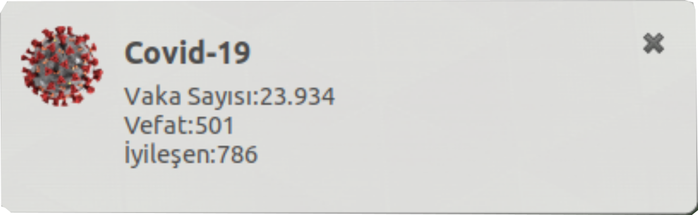

# covid-19 stats
Türkiyedeki Covid-19 vaka,vefat ve iyileşen sayısını saatte bir bildirim olarak gösteren programdır

<h1>Kurulumu</h1>
-Öncelikle <a href="/corona_stats.py" target="_blank">corona_stats.py</a> ve <a href="/corona_ico.png" target="_blank">corona_ico.png</a>dosyaları indirin. İndirdikten sonra dosyaların aynı dizinde olduğuna emin olun

-Sonra arama kısmından Startup Applications'u çalıştırın ve Add'e basın.

-Daha sonra isme <code>Covid-19</code> comut kısmına da <code>python "corona_stats.py dosyasının konumu"</code>(konum tırnak içinde olmalı) yazın ve add'a basın.

-Son olarak oturumunuzu yeniden başlatın ve bildirimleri alın.
